## 講義・実習の目的

- 理論・実験を問わず、学部〜大学院〜で必要となる現代的かつ普遍的な計算機の素養を身につける
- より高度な数値計算アルゴリズム・数値計算の常識を学ぶ
- 物理学における具体的な問題を通して実践的な知識と経験を身につける
- 数学公式と数値計算アルゴリズムは別物であることを理解する
- 刻み幅・近似度合い・サンプル数・初期状態・乱数seed・ビン幅を変えて結果を確認する
- 計算量(コスト)のスケーリング(次数)に気をつける
- いろいろな手法を組み合わせて問題を解決する

## 講義・実習内容

- 問題解決型: 計算機実験Iで身に付けた知識をもとに、より高度な数値計算手法・アルゴリズムを学び、物理学における具体的な問題への応用を通して実践的な知識と経験を身につける

   - 取り上げる問題

      - ランダムプロセス
      - 統計力学(イジング模型)
      - 拡散方程式、波動方程式
      - 量子力学(1粒子系、実時間発展、横磁場イジング模型、量子コンピュータ)
      - 力学系・粒子系
   - 取り上げる計算手法・アルゴリズム

      - モンテカルロ法・マルコフ連鎖モンテカルロ法
      - 行列の対角化・疎行列分解
      - 有限差分法、偏微分方程式の解法
      - 常微分方程式の積分、分子動力学
      - 連続最適化、離散最適化

   などを予定

## 講義と実習

- スタッフ [computer@phys.s.u-tokyo.ac.jp](mailto:computer@phys.s.u-tokyo.ac.jp)

   - 講義: 藤堂
   - 実習: 諏訪助教(藤堂研)、高橋助教(樺島研)
   - 実習TA: 所(藤堂研)
- 講義・実習の進め方

   - 講義(座学)と実習を実施
   - 実習の回には各自PCを持参すること
- 評価

   - レポート(計2回)
   - グループ内プレゼンテーション(実習3,4の回に実施予定)
   - 出席（実習の回）

## 講義日程 (予定)

- 全8回 (金曜5限 16:50-18:35)

   - 10月2日(金) 講義1: モンテカルロ法と統計力学
   - [10月9日 休講]{.gray}
   - 10月16日(金) 実習1
   - 10月23日(金) 講義2: 分子動力学と統計的サンプリング
   - 10月30日(金) 実習2
   - [11月6日 休講]{.gray}
   - 11月13日(金) 講義3: 偏微分方程式と量子系の時間発展
   - 12月4日(金) 実習3
   - [12月11日 休講]{.gray}
   - 12月18日(金) 講義4: 自動微分・共役勾配法と最適化の応用
   - [12月25日 休講]{.gray}
   - 1月8日(金) 実習4
   - [1月22日・29日 休講]{.gray}

# モンテカルロ積分と統計誤差

## 乱択アルゴリズム(randomized algorithm)

- 実行中に乱数を参照してその値によって振る舞いをかえるアルゴリズム
- ラスベガスアルゴリズム

   - 乱数の出方によらず常に正しい結果を与えるアルゴリズム
   - 平均化効果を利用するアルゴリズム：クイックソート
- モンテカルロアルゴリズム

   - 乱数の出方によっては誤った結果を与えるアルゴリズム
   - 標本を利用するアルゴリズム：最小カット問題
   - くじ引き型のアルゴリズム：素数性判定、関数の同一性、行列積の検算
   - サンプリングアルゴリズム：モンテカルロ積分、マルコフ連鎖モンテカルロ

## 乱択クイックソート

- 分割統治法に基づく再帰的なソートアルゴリズム

   - 配列の中から要素(ピボット)を一つ選び、左からその値以上の要素を、右からその値未満の要素を検索し入れ替え
   - 検索が終了したら2つの集合に分ける
   - それぞれの集合について再帰的にソートを行う
   - 結果を結合
- ほぼ同じ大きさの集合に分けることができる場合の実行ステップ数$\sim {\cal O}(n \log n)$
- 最悪(ピボットが常に最大 or 最小値)の場合のステップ数$\sim {\cal O}(n^2)$
- 分割に用いる要素を「ランダムに」選ぶ $\Rightarrow$ 平均ステップ数$\sim {\cal O}(n \log n)$

## クイックソート

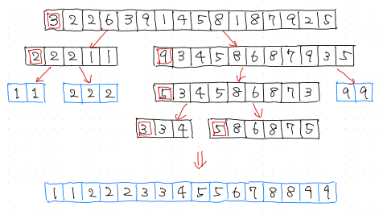{height="490"}

## 最小カット問題

- 「最小カット (min-cut)」= 連結グラフを二つの部分に分けるために切らなければならない辺(エッジ)の集合のうち、もっとも小さいもの
- ``Randomized Min-Cut Algorithm''

   - ランダムに辺を一つ選ぶ
   - 辺の両端の頂点を一つにつぶす(自己ループは取り除く)
   - 残りの頂点が二つになるまで繰り返す
- 上の試行を何回も繰り返して、得られたうちで最小なカットを結果とする
- 頂点の数が $n$ のグラフに関して、正解が得られる確率：少なくとも $\frac{2}{n(n-1)}$

## 最小カット問題

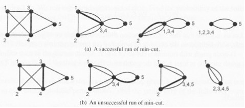{height="350"}

## 物質中の中性子輸送

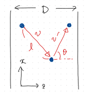{width="45%"}

## 物質中の中性子輸送

- ある板状の物質(厚さ$D$)に垂直に中性子が入射したときの吸収率・透過率・反射率
- 中性子はある確率で物質の原子核に衝突し、確率$p_{\rm c}$で吸収、$p_{\rm s}=1-p_{\rm c}$で散乱される

   - 衝突は確率的に起きるので、次の衝突までの距離$\ell$は指数分布にしたがう($\lambda^{-1}$: 平均自由行程)

      $$
      p(\ell) = \lambda e^{-\lambda\ell}
      $$
   - 衝突時、ランダムな方向に散乱されるとすると

      $$
      p(\theta,\phi) \, d\theta \, d\phi = \frac{d\Omega}{4\pi} = \frac{\sin \theta}{4\pi} \, d\theta \, d\phi
      $$

      $$
      p(\theta) = \frac{\sin \theta}{2} \qquad p(\phi)=\frac{1}{2\pi}
      $$

## モンテカルロシミュレーション

1. 初期条件 $z=0$, $\theta = 0$
1. [指数分布から$\ell$を選ぶ]{.red}
1. $z \leftarrow z + \ell \cos \theta$
1. $z<0$ → 反射(終了)

   $z>D$ → 透過(終了)

   $0 < z < D$ → 確率$p_{\rm c}$で吸収(終了)、$p_{\rm s}$で散乱
1. [散乱後の$\theta$を選び]{.red}、2に戻る

   ただし、$\theta$ 自体を一様に選ぶのではなく、$\cos\theta$ を $[-1,1]$ の一様分布から選ぶ

{width="25%"}

## 乱数発生器の選び方

- 疑似乱数を使う場合の注意

   - 万能乱数発生器は存在しない
   - 計算式に従って生成するため、必ず周期は有限、何らかの相関あり
   - 乱数の性質について、数学的に厳密な証明やテスト結果があるが、特定のシミュレーションに使う場合について何も保証してくれない
   - 自分で乱数発生器を「発明」してはいけない
   - 自分で乱数発生器をプログラムしてはいけない(既存のライブラリを使う)
   - 初期化(種・シードの設定)を正しく行う
   - 実際にそれらしい乱数が生成されているか、グラフに描いて確認する
   - 二種類以上の乱数発生器を使ってみて、結果が一致するか確認
- 代表的な乱数発生器のひとつ: メルセンヌ・ツイスター

   - 周期 $2^{19937}-1$、高速、日本製!
   - ヘッダファイル: [mersenne\_twister.h](https://github.com/todo-group/computer-experiments/blob/master/exercise/monte_carlo/mersenne_twister.h)
   - サンプルプログラム: [random.c](https://github.com/todo-group/computer-experiments/blob/master/exercise/monte_carlo/random.c)

## 様々な分布

- 乱数発生器は通常、一様な整数乱数あるいは実数乱数を生成
- 一様分布以外の分布にしたがう乱数の発生方法の代表例
- 逆関数法

   - 確率分布関数$F(x)$の逆関数$F^{-1}(y)$ と(0,1)の一様乱数$u$から $v=F^{-1}(u)$
   - 例: 指数分布 $p(x) = \frac{1}{\mu} e^{-x/\mu}$

      $F(x) = 1 - e^{-x/\mu}$ \ \ \ $F^{-1}(y) = - \mu \log(1-y)$
   - 一般の確率分布関数について逆関数を求めるのは困難
- 棄却法

   - 確率密度関数を完全に囲むような箱を用意し、その箱の中で一様乱数を生成
   - 確率密度関数の下側の点が生成されたら、その$x$座標を乱数として採用。上側の点の場合には再度生成
   - もとの確率密度関数よりも箱が大きくなりすぎると非効率

## Box-Muller法

- 一様分布乱数から正規分布乱数を生成する方法

   - 2次元の(標準)ガウス分布を考える

      $$
      f(x,y)\,dx\,dy= \frac{1}{2\pi} e^{-(x^2+y^2)/2} \,dx\,dy
      $$
   - 極座標$(r,\theta)$に変換 ($x=r\cos\theta$, $y=r\sin\theta$)

      $$
      \frac{1}{2\pi} e^{-(x^2+y^2)/2} \,dx\,dy = \frac{1}{2\pi} r \, e^{-r^2/2} \,dr\,d\theta
      $$
   - $\theta$は$(0,2\pi)$の一様分布
   - $r$は$f(r) = r \, e^{-r^2/2}$に従う → 逆関数法で生成

      $$
      \begin{aligned}
      F(r) = \int_0^r f(r) \, dr = 1 - e^{-r^2/2}, \qquad r = F^{-1}(q) = \sqrt{- 2 \log(1-q)}
      \end{aligned}
      $$
   - 二つの一様乱数から二つの独立な正規分布乱数が生成される

# 重点的サンプリング

## モンテカルロ積分

- 円周率を与える公式

   $$
   \pi = \lim_{c \rightarrow \infty} \int_0^c f(x) \, dx \ \ \ f(x) = \frac{2}{\cosh x}
   $$
- スタンダードな数値積分法: 台形公式 (一次式補間), シンプソン公式 (二次式補間), etc
- カットオフ $c$ の値

   - 誤差は $c$ が大きくなると指数関数的に小さくなる
   - 例えば $c = 20$ で誤差は $8.3 \times 10^{-9}$ 以下

## 単純サンプリング

::: {.columns}

::: {.column width="60%"}

- $[0,c]$ と $[0,2]$ の一様分布から二次元上の点 $(x,y)$ を $M$ 組生成
- $f(x)$ の下に入った数 $N$ をカウント

   $$
   \pi \simeq 2c \times \frac{N}{M}
   $$

   | $M$ | 平均値 | 誤差 |
   | :---: | :---: | :---: |
   | 100 | 4.8 | 1.3 |
   | 10000 | 3.12 | 0.11 |
   | 1000000 | 3.154 | 0.011 |

:::

::: {.column width="40%"}

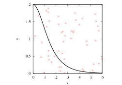{height="315"}

:::

:::

## 統計誤差の評価

- このモンテカルロ積分が実際に評価している積分

   $$
   \frac{1}{2c} \int_0^c \!\! \int_0^2 \!\! \theta(x,y) \, dx \, dy
   \ \ \ \theta(x,y) = \begin{cases} 2c & \text{if $y < f(x)$} \\ 0 & \text{otherwise} \end{cases}
   $$
- 統計誤差の評価

   - 試行の成功確率(success probability): $q=\frac{\pi}{2c}$
   - 一回の試行の平均値(mean): $\mu = 2c \times q = \pi$
   - 分散(variance):

      $$
      s^2 = (2c)^2q + 0^2(1-q) - \mu^2 = 2c\pi-\pi^2 = 4c^2 q(1-q)
      $$
   - $c=20$ の時:

      $$
      q \simeq 0.0785 \ \ \ s^2 \simeq 116
      $$

## 中心極限定理(central limiting theorem)

- $M$回の試行のうち $N$回成功する確率 ($\pi$の見積もり値が $m=2cN/M$ となる確率)

   $$
   p(m=2c\frac{N}{M}) = \frac{M!}{N!(M-N)!} q^N (1-q)^{M-N}
   $$
- 両辺の対数をとってスターリングの公式を使う

   $$
   \log p(m) \simeq \frac{M}{2c} (m \log \frac{\pi}{m} + (2c-m)\log \frac{2c-\pi}{2c-m})
   $$
- $m$ に関して平均値 $\pi$ の周りで二次まで展開

   $$
   \log p(m) \simeq -\frac{M}{2s^2}(m-\pi)^2
   $$
- 分散$s^2/M$の正規分布(中心極限定理)
- 統計誤差は $\sqrt{M}$ に反比例して減少 $\Rightarrow$ 1桁小さくするには100倍の計算が必要

## 単純サンプリング(2)

::: {.columns}

::: {.column width="60%"}

- $y$ に関してあらかじめ積分
- $[0,c]$の一様乱数 $x$ を用いて

   $$
   \int_0^c \frac{f(x)}{p(x)} p(x) \, dx \simeq \frac{1}{M} \sum_i c f(x_i) \ \ \ p(x) = \frac{1}{c}
   $$

   | $M$ | 平均値 | 誤差 |
   | :---: | :---: | :---: |
   | 100 | 3.1 | 0.8 |
   | 10000 | 3.00 | 0.08 |
   | 1000000 | 3.147 | 0.008 |

:::

::: {.column width="40%"}

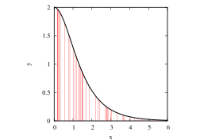{height="315"}

:::

:::

## 誤差の評価

- 関数 $f(x)/p(x)$ の分散

   $$
   s^2 = \int_0^c \Big(\frac{f(x)}{p(x)}\Big)^2 p(x) \, dx - \pi^2 = c \int_0^\infty f^2(x) \, dx - \pi^2 = 4c - \pi^2
   $$
- $c=20$ のとき $s^2 \simeq 70.1$
- 同じ試行回数 $M$ の時, 誤差は$\sqrt{70.1/116} = 0.77$ 倍
- もしくは $M$ を $116/70.1 = 1.65$ 倍したのと同じ効果
- 積分次元は低ければ低いほど良い

## 次元の呪い(curse of dimensionality)

- $n$次元超立方体(1辺の長さ 2, 体積 $2^n$)に対する$n$次元単位球の体積の割合

   $$
   q = \frac{\pi^{n/2} / \Gamma(\frac{n}{2}+1)}{2^n} \sim (\pi/n)^{n/2}
   $$

   $n=10$ で 0.2%, $n=20$ で $10^{-8}$, $n=100$ で $10^{-70}$
- モンテカルロ積分で球の体積を計算しようとすると, 標準偏差に対する平均値の割合は指数関数的に小さい

   $$
   \frac{q}{\sqrt{q(1-q)}} \sim \sqrt{q}
   $$
- 次元が高くなるにつれて指数関数的に大きな $M$ が必要となる
- c.f. 通常の数値積分(台形公式等)でも同様

## 重点的サンプリング

- (平均値が同じなら)被積分関数の分散が小さければ小さいほど良い (= 統計誤差が小さい)
- サンプリングの分布 $p(x)$ の形が $f(x)$ に近い程良い
- $f(x)$ の値が大きい所はより頻繁にサンプリング
- 重点的サンプリング (importance sampling)

## 重点的サンプリング

::: {.columns}

::: {.column width="60%"}

- 積分への寄与が大きな箇所をより重点的にサンプリング

   $$
   p(x) = e^{-x}
   $$

   | $M$ | 平均値 | 誤差 |
   | :---: | :---: | :---: |
   | 100 | 3.06 | 0.06 |
   | 10000 | 3.142 | 0.006 |
   | 1000000 | 3.1412 | 0.0006 |
- 実際のサンプリングの方法

   - $u$を $0<u<1$ の一様乱数として、

      $$
      x = -\log u, \qquad \frac{f(x)}{p(x)} = \frac{4}{1+e^{-2x}} = \frac{4}{1+u^2}
      $$

:::

::: {.column width="40%"}

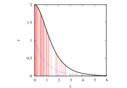{height="315"}

:::

:::

## 誤差のサンプル数依存性

- 関数 $f(x)/p(x)$ の分散

   $$
   s^2 = \int_0^c \Big(\frac{f(x)}{p(x)}\Big)^2 p(x) \, dx - \pi^2 \simeq 2(2+\pi) - \pi^2 = 0.414
   $$
- 同じ試行回数 $M$ の時, 誤差は

   $\sqrt{0.414/116} = 0.06 \mbox{倍}$
- もしくは $M$ を 280 倍したのと同じ

   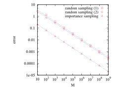{height="315"}

## 理想的な重点的サンプリング?

- 理想的には $p(x)$ を $f(x)$ に比例するように取れば良い
- このとき $f(x) / p(x)$ は定数(分散ゼロ) → 1回のサンプリングで厳密な結果が得られる???
- 実際には $p(x)$ が確率密度となるように規格化条件から定数 $c$ を決めておく必要あり

   $$
   \int p(x) \, dx = c \int f(x) \, dx = 1
   $$
- $c$ は今欲しい答の逆数!
- $p(x) \sim f(x)$で分散はゼロになるが、重みを評価するには求めたい積分値を先に知る必要がある
- 正規化定数を知らずに、分布から標本を生成することはできるか？

# 体系の統計力学とイジング模型

## 典型的な統計力学モデル

- 古典粒子系 (連続変数)

   - 調和振動子 \ \ $\displaystyle H = \frac{p^2}{2m} + \frac{k}{2}x^2$
   - 多粒子系

      $$
      H = \sum \frac{p_i^2}{2m} + \sum_{\langle i,j \rangle} V(x_i, x_j)
      $$
   - バネビーズ模型 (高分子の模型)

      $$
      H = \sum \frac{p_i^2}{2m} + \frac{k}{2} \sum_{\langle i,j \rangle} |x_i-x_j|^2
      $$
- 古典スピン模型 (離散変数/連続変数)

   - イジング模型 \ \ $\displaystyle H = -J \sum_{\langle i,j \rangle} \sigma_i \sigma_j$ \ \ \ $\sigma_i = \pm 1$
   - ハイゼンベルグ模型 \ \ $\displaystyle H = -J \sum_{\langle i,j \rangle} \vec{S}_i \cdot \vec{S}_j$ \ \ \ $|\vec{S}_i| = 1$

## 多体系の統計力学

- カノニカル分布 \ $\pi(s) = \exp [- \beta H(s) ] / Z$ \ \ \ ($\beta = 1/(k_{\rm B} T)$)
- 分配関数・自由エネルギー

   $$
   \begin{aligned}
   Z(T) &= \int \exp [- \beta H(p,x) ] \, dp \, dx \qquad \text{(連続変数)} \\
   &= \sum_s \exp [- \beta H(s) ] \qquad \text{(離散変数)} \\
   F(T) &= - \beta^{-1} \log Z(T)
   \end{aligned}
   $$
- 物理量の期待値

   $$
   \begin{aligned}
   \langle A \rangle &= Z^{-1} \int A(p,x) \exp [- \beta H(p,x) ] \, dp \, dx \qquad \text{(連続変数)} \\
   &= Z^{-1} \sum_s A(s) \exp [- \beta H(s) ] \qquad \text{(離散変数)}
   \end{aligned}
   $$

## 多体系の統計力学

- 内部エネルギー

   $$
   \begin{aligned}
   E &= -\frac{\partial}{\partial\beta} \log Z = Z^{-1} \sum_s H(s) \exp [- \beta H(s) ] = \langle H \rangle
   \end{aligned}
   $$
- 比熱

   $$
   \begin{aligned}
   C &= \frac{1}{N} \frac{\partial E}{\partial T} = \frac{\beta^2}{N} (\langle H^2 \rangle - \langle H \rangle^2)
   \end{aligned}
   $$

# マルコフ連鎖モンテカルロ

## 統計物理における平衡状態

- カノニカル分布: $\pi(s) = \exp[-\beta {\cal H}(s)] \Big / \sum_s \exp[-\beta {\cal H}(s)]$
- 物理量の期待値: $\langle A \rangle = \sum_s A(s) \exp[-\beta {\cal H}(s)] \Big/ \sum_s \exp[-\beta {\cal H}(s)]$
- $\sum_s$は全ての状態に関する和 (系の体積に対して指数関数的に増加)

   $\Rightarrow$ [次元の呪い]{.red}
- 全ての状態について和をとるかわりに、ボルツマン重みが大きい(=$\cal H$が小さい)ところだけを重点的にサンプリング

   低温では$\exp[-\beta {\cal H}(s)]$の[分散が指数関数的に大きく]{.red}なる $\Rightarrow$ 配位$s$をカノニカル分布にしたがって生成することで分散を小さく

## マルコフ連鎖モンテカルロ

- 任意の多次元確率分布(今の場合はカノニカル分布)について、その分布にしたがうサンプル(状態)を生成する方法

   - 直接カノニカル分布から独立したサンプリングをおこなうことは難しい
   - 直前の状態からある確率にしたがって、次の状態を生成(マルコフ連鎖、Markov chain)

      $$
      \begin{split}
      &{\rm Pr}(X_{n+1}=s_j \,|\, X_0 = s_{i_0}, X_1 = s_{i_1}, \cdots, X_n = s_{i}) \\
      & \qquad = {\rm Pr}(X_{n+1}=s_j \,|\, X_n = s_{i}) = P_{i,j}
      \end{split}
      $$
   - 長時間極限でカノニカル分布が達成されるように遷移確率(行列)$P_{i,j}$を選ぶ

      $$
      \lim_{n\rightarrow\infty}{\rm Pr}(X_n=s_j) = \pi_j = \exp[-\beta {\cal H}(s_j)] / Z
      $$

## 遷移行列が満たすべき条件

- 確率であるための条件: $0 \le P_{i,j} \le 1$
- 確率保存: $\sum_j P_{i,j} = 1$
- エルゴード性(ergodicity):

   ある整数$M$が存在し、$n \ge M$の全ての$n$で$(P^n)_{i,j} > 0$
- つりあいの条件(balance condition):

   $$
   \sum_{i=1}^k \pi_i P_{i,j} = \pi_j
   $$

   カノニカル分布が固有値1の左固有ベクトル

## Perron-Frobeniusの定理

- 正の正方行列$A$(すべての要素が正)について以下が成り立つ

   - 他の全ての固有値よりも絶対値の大きな正の固有値$r$が存在する
   - 固有値$r$は単純固有値である(縮退していない)
   - 固有値$r$に対する右(左)固有ベクトル$v$ ($w$) は正のベクトルである
   - 固有値 $r$ は $\displaystyle \min_i \sum_j a_{ij} \le r \le \max_i \sum_j a_{ij}$ を満たす
- $A$が零の要素を持つ場合でも$A$が原始的(primitive = エルゴード的)である限り、上の結果は成り立つ
- 遷移行列は上の条件を満たす

   - カノニカル分布は絶対値最大の固有ベクトル
   - 遷移行列を掛けていくとカノニカル分布に収束

## 詳細つりあいの条件

- 実際には「つりあいの条件」よりもさらに厳しい「詳細つりあいの条件 (detailed balance condition)」を考えることが多い

   $$
   \pi_i P_{i,j} = \pi_j P_{j,i}
   $$
- 両辺を $i$ について和をとると「つりあいの条件」に帰着する
- 「詳細つりあいの条件」は「つりあいの条件」の十分条件

## 調和ポテンシャル中の古典粒子

- ポテンシャルエネルギー

   $$
   V(x) = x^2
   $$
- カノニカル分布

   $$
   P(x) = \frac{e^{-\beta V(x)}}{\int e^{-\beta V(x)} \, dx}
   $$
- 物理量の期待値

   $$
   \langle x^2 \rangle = \frac{\int x^2 e^{-\beta V(x)} \, dx}{\int e^{-\beta V(x)} \, dx}
   $$
- 逆温度$\beta$が大きいと被積分関数の分散が非常に大きい $\Rightarrow$ 重点的サンプリング

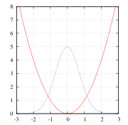

## Metropolis法

- 現在の配位$x$から、試行配位(trial configuration) $x'$を$x - \Delta \sim x + \Delta$の一様分布より選ぶ
- 確率$\min \Big( 1, \frac{e^{-\beta V(x')}}{e^{-\beta V(x)}} \Big)$で$x'$を採択(accept)。棄却(reject)された場合にはもとの$x$のまま
- 物理量の測定 (reject された場合にもカウントする)
- 採択確率(acceptance probability)は、$\frac{e^{-\beta V(x')}}{e^{-\beta V(x)}+e^{-\beta V(x')}}$でもよい
- 例: [harmonic.c](https://github.com/todo-group/computer-experiments/blob/master/exercise/monte_carlo/harmonic.c)

## イジング模型に対するモンテカルロ法

- 更新の単位は一つのスピンとするのが一番自然
- メトロポリス法に必要なのは更新前後のエネルギー差だけなので、全エネルギーを計算しなおす必要なし

   ```{.verbatim}
   for (s = 0; s < num_sites; ++s) {
     delta = 0.0;
     for (j = 0; j < num_neighbors; ++j) {
       v = mat_elem(neighbor, s, j);
       delta += 2 * J * spin[s] * spin[v];
     }
     if (random() < exp(-beta * delta))
       spin[s] = -1 * spin[s];
   }  
   ```

## 物理量の計算

- 内部エネルギー$E$

   - 初期状態のスピンを全て上向き(1)に取ると$E=-J \times \text{ボンド数}$
   - モンテカルロステップ毎にエネルギーの変化分を計算しているので、採択された場合にはその値を足し込む
- 比熱$C$: 内部エネルギーのゆらぎから計算できる

   $$
   C = \frac{1}{N} \frac{\partial E}{\partial T} = \frac{1}{NT^2} (\langle E^2 \rangle - \langle E \rangle^2)
   $$
- 磁化$m$: スピンの値の平均値 $m = \frac{1}{N} \sum_i \sigma_i$

   - 外部磁場がない場合、対称性から$m$の長時間平均は厳密には零になる
   - 熱力学極限では対称性が自発的に破れて、低温で有限の$m$
   - シミュレーションでは$m$ではなく$m^2$を見るとよい

# 平衡化・自己相関・誤差評価

## モンテカルロステップの設定

- 全てのスピンについて一通り更新を試すのを、1モンテカルロステップと数える
- どれくらいのモンテカルロステップが必要かは、あらかじめは分からない
- 典型的には、$10^4$--$10^6$程度にとることが多い
- 熱平衡化 (thermalization)

   - 初期配位依存性を取り除くため、モンテカルロステップの最初の部分は捨てる(burn-in time)
   - 典型的には、全体の1割程度を捨てることが多い

## Metropolis法によるシミュレーション

- $\Delta = 0.1$

   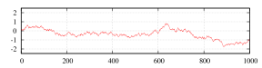
- $\Delta = 1$

   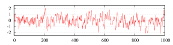
- $\Delta = 10$

   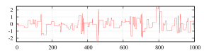

## 自己相関と有効サンプル数

- 測定値の平均と母分散

   $$
   \overline A=\frac{1}{M}\sum_{i=1}^{M}A_i,
   \qquad
   \sigma^2=\langle A^2\rangle-\langle A\rangle^2
   $$

   MCMCで得られた測定値には、時間方向の相関がある
- 自己相関関数と積分自己相関時間 (物理量 $A$ ごとに異なる)

   $$
   C(t)=
   \frac{\langle A_iA_{i+t}\rangle-\langle A\rangle^2}
   {\langle A^2\rangle-\langle A\rangle^2},
   \qquad
   \tau_{\mathrm{int}}=\sum_{t=1}^{\infty}C(t)
   $$
- 自己相関を考慮した平均値の分散と有効サンプル数

   $$
   \left\langle(\overline A-\langle A\rangle)^2\right\rangle
   \simeq
   \frac{\sigma^2}{M}\left(1+2\tau_{\mathrm{int}}\right)
   \qquad M_{\mathrm{eff}}=\frac{M}{1+2\tau_{\mathrm{int}}}
   $$

   独立な標本では $C(t)=\delta_{t,0}$、$\tau_{\mathrm{int}}=0$、$M_{\mathrm{eff}}=M$。
   積分自己相関時間が長いほど、同じ測定回数でも平均値の統計誤差は大きくなる

## ビニングによる誤差評価

- 連続する $n$ 個の測定値を、一つのビンにまとめる
- 測定値 $M$ 個を $m=M/n$ 個のビンに分け、ビンごとの平均を計算

   $$
   \overline A_k^{(n)}
   =\frac{1}{n}\sum_{i=n(k-1)+1}^{nk}A_i
   \qquad(k=1,\ldots,m)
   $$

   ビン平均の平均は、元のデータ全体の平均 $\overline A$ に等しい
- ビン平均の分散を求める

   $$
   \left(s^{(n)}\right)^2
   =\frac{1}{m-1}\sum_{k=1}^{m}
   \left(\overline A_k^{(n)}-\overline A\right)^2
   $$
- 全体の平均値$\overline{A}$の分散の推定値を求める。ビン平均の分散を、さらにビン数 $m$ で割る

   $$
   \boxed{
   \left(\sigma^{(n)}\right)^2
   =\frac{1}{m}\left(s^{(n)}\right)^2
   =\frac{n}{M}\left(s^{(n)}\right)^2
   }
   $$
- ビン幅を変えて、誤差の推定値が安定することを確認する

## 自己相関時間と統計誤差

- $M$ を固定して $n$ を増やし、$n\gg\tau_{\mathrm{int}}$ で
   $\left(\sigma^{(n)}\right)^2$ がほぼ一定になる範囲を探す。
   その一定値の平方根 $\sigma^{(\infty)}$ を平均値の標準誤差とする
- ビン幅を大きくしすぎるとビン数が減り、誤差の推定自体が不安定になる。ビン数は、最低でも10程度を残すことを目安とする

自己相関時間  統計誤差

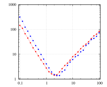{width="49%"}
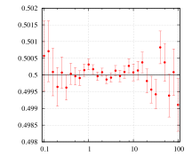{width="49%"}

$\Delta$  $\Delta$

## マルコフ連鎖モンテカルロ法

- 任意の多次元確率分布関数について、その分布したがうサンプルを生成する方法

   - 分布関数は正規化されている必要はない
   - 逆に、正規化定数をマルコフ連鎖モンテカルロで計算するのは難しい
- 統計誤差はサンプルの生の分散$s^2$とサンプル数$M$、自己相関時間$\tau_\text{int}$で決まる

   $$
   \sigma^2_{\overline{A}} \simeq \frac{s^2 (1+2\tau_\text{int})}{M}
   $$

   - 一度に大きく配位を動かそうとすると棄却率が増加 $\Rightarrow$ $\tau_\text{int}$が増加
   - 動かす幅を小さくするとは採択率は高いが相関が消えない $\Rightarrow$ $\tau_\text{int}$が増加
   - 非局所更新法、拡張アンサンブル法など様々な方法が使われている
- 物理以外でも、Bayes推定や機械学習、社会現象のシミュレーションなど広く使われている
